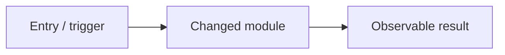

## High-level diagram

## Description

<!-- What changed and why. Scope in/out. Link Jira. Companion PRs if full-stack. -->

- 
- Scope in: ...
- Scope out: ...
- Jira: https://voiceagentai.atlassian.net/browse/KAN-XX

## Test cases

<!-- Ticket TCs and local verification. Prefer Given / When / Then. -->

- [ ] TC-001 -
- [ ] TC-002 -
- [ ] `npm test` passes
- [ ] Docs updated
- [ ] Manual check against acceptance criteria
